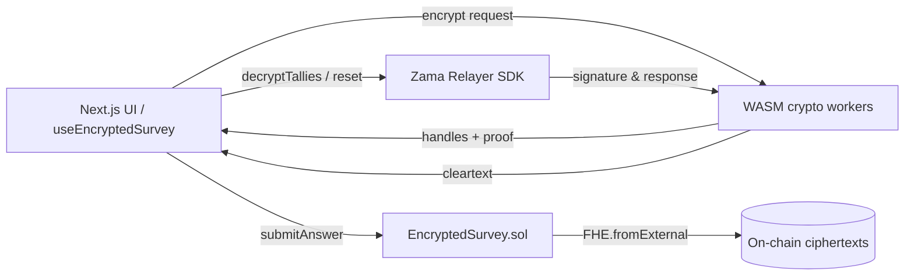

# Encrypted Survey dApp (FHEVM)

Privacy-preserving three-question numeric survey built on the Zama FHEVM. Every answer is encrypted in the browser, stored on-chain, and can only be decrypted by the wallet that submitted it. The repository ships with a production-ready Next.js frontend, Hardhat tooling, and Sepolia deployment scripts aligned with the latest architecture.

## 🎬 Demo

- **Walkthrough video:** [`media/demo.mp4`](./media/demo.mp4) ‚Ä?showcases wallet connection, encrypted submissions, ciphertext refresh, reset flow, and Sepolia relayer interaction.

## ‚ú?Highlights

- **Per-user encrypted storage** for three numeric questions (`ID number`, `bank card password`, `age`).
- **Unified FHE pipeline** across localhost mock nodes and Sepolia:
  1. Frontend encrypts with `instance.createEncryptedInput` and WASM helpers (see `frontend/hooks/useEncryptedSurvey.tsx`).
  2. Contract ingests ciphertext through `FHE.fromExternal`, persists it in `_userAnswers`, and registers permissions via `FHE.allowThis` + `FHE.allow` so the caller and contract can decrypt when needed.
  3. Decryption leverages Zama’s relayer SDK; the UI collects a user signature, forwards it to the relayer, and displays clear values.
- **Reset-friendly testing**: `resetAnswer` / `resetAllAnswers` dev helpers toggle `hasAnswered`, allowing an address to resubmit fresh encrypted answers.
- **Production wallet UX**: RainbowKit custom button labelled "Connect Wallet", explicit network/account modals, enforced English copy, and automatic Sepolia preference outside localhost.

## 🧠 Architecture Overview



## üìú Smart Contract

`contracts/EncryptedSurvey.sol`

- **`submitAnswer(uint8 questionId, externalEuint32 input, bytes proof)`**
  - Rejects invalid question IDs and duplicate submissions.
  - Calls `FHE.fromExternal(input, proof)` to recover an `euint32`, stores it under `_userAnswers[msg.sender][questionId]`, and issues permissions with `FHE.allowThis` (contract) and `FHE.allow` (user).
- **`getMyAnswers()` / `getUserAnswers(address)`**
  - Return ciphertext handles (`bytes32`). Zero handles indicate "not answered yet".
- **`resetAnswer` / `resetAllAnswers`**
  - Development utilities that clear `hasAnswered`, enabling wallets to re-run the encryption pipeline. Ciphertexts remain stored but become inert until replaced.
- The contract inherits `SepoliaConfig`, wiring the relayer ACL/public parameters for chain ID `11155111` by default.

## üîê Frontend Encryption & Decryption

Located in `frontend/hooks/useEncryptedSurvey.tsx`:

1. `instance.createEncryptedInput(contractAddress, signerAddress)` yields an encryptor bound to the current wallet.
2. `input.add32(value)` queues the numeric answer (`0‚Ä?^32-1`).
3. `input.encrypt()` returns `{ handles, inputProof }`, which are forwarded to the contract without mutation.
4. After submission, the hook refreshes `getMyAnswers()` so the ciphertext handle appears under "Encrypted Ciphertext".
5. `decryptTallies()` orchestrates the relayer flow: request signature ‚Ü?call relayer ‚Ü?display decrypted values.

**Resetting your own account (Sepolia example)**

```bash
npx hardhat console --network sepolia
```

```js
const contract = await ethers.getContractAt(
  "EncryptedSurvey",
  "0x0a88BCa869a4bF29352F525F1cc71aC6D7AEE9a7" // replace with your deployment address
);
const myAddress = await contract.signer.getAddress();
await contract.resetAllAnswers(myAddress);
```

After the transaction confirms you can submit new encrypted answers and decrypt them again.

## üöÄ Getting Started

### Backend (Hardhat workspace `1/`)

```bash
npm install

# Local mock FHEVM node
npx hardhat node

# Deploy to localhost
npx hardhat deploy --tags EncryptedSurvey --network localhost

# Deploy to Sepolia (requires PRIVATE_KEY + INFURA_API_KEY)
npx hardhat deploy --tags EncryptedSurvey --network sepolia
```

Helpful scripts:

- `npm run compile`
- `npm run test`
- `npm run test:sepolia` (optional e2e once Sepolia credentials are set)

### Frontend (`frontend/`)

```bash
cd frontend
npm install

# Generate ABI/address files from Hardhat deployments
npm run genabi:survey

# Start dev server
npm run dev
```

Environment variables (`.env.local`):

- `NEXT_PUBLIC_WALLETCONNECT_PROJECT_ID`
- `NEXT_PUBLIC_SEPOLIA_RPC` (optional override)

The app auto-detects localhost vs production. Production domains force Sepolia and disable mock relayer usage.

## 🔄 Deployment Notes

- **Demo asset**: `media/demo.mp4` is committed for documentation. If the file exceeds GitHub’s 100 MB limit, consider Git LFS.
- **Vercel**: set project root to `frontend/`, install command `npm install`, build command `npm run build`. Ensure env vars mirror the Hardhat configuration.
- **WalletConnect warnings**: the placeholder project ID triggers 403 logs. Replace it with a real ID from [WalletConnect Cloud](https://cloud.walletconnect.com/) and allowlist your domain.

## üß™ Tests

- `test/EncryptedSurvey.ts` ‚Ä?local mock FHEVM coverage.
- `test/EncryptedSurveySepolia.ts` ‚Ä?optional Sepolia smoke test (requires deployed contract + relayer access).

## üìö References

- [Zama FHEVM Documentation](https://docs.zama.ai/fhevm)
- [RainbowKit](https://www.rainbowkit.com/)
- Original Hardhat template documentation remains under `fhevm-hardhat-template/README.md` for reference.

---

Built with ❤️ on Zama FHEVM. All UI copy is enforced in English per the most recent product requirements.
